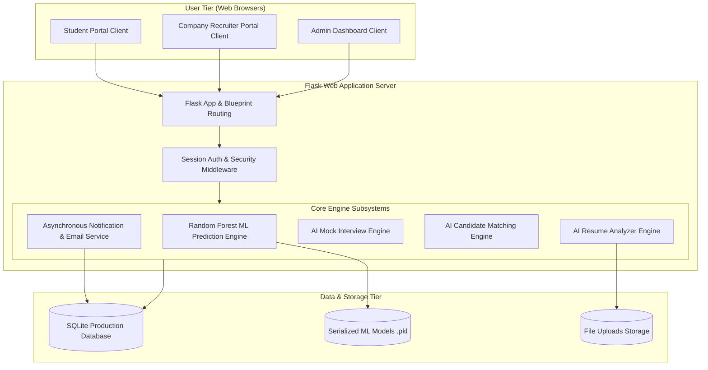
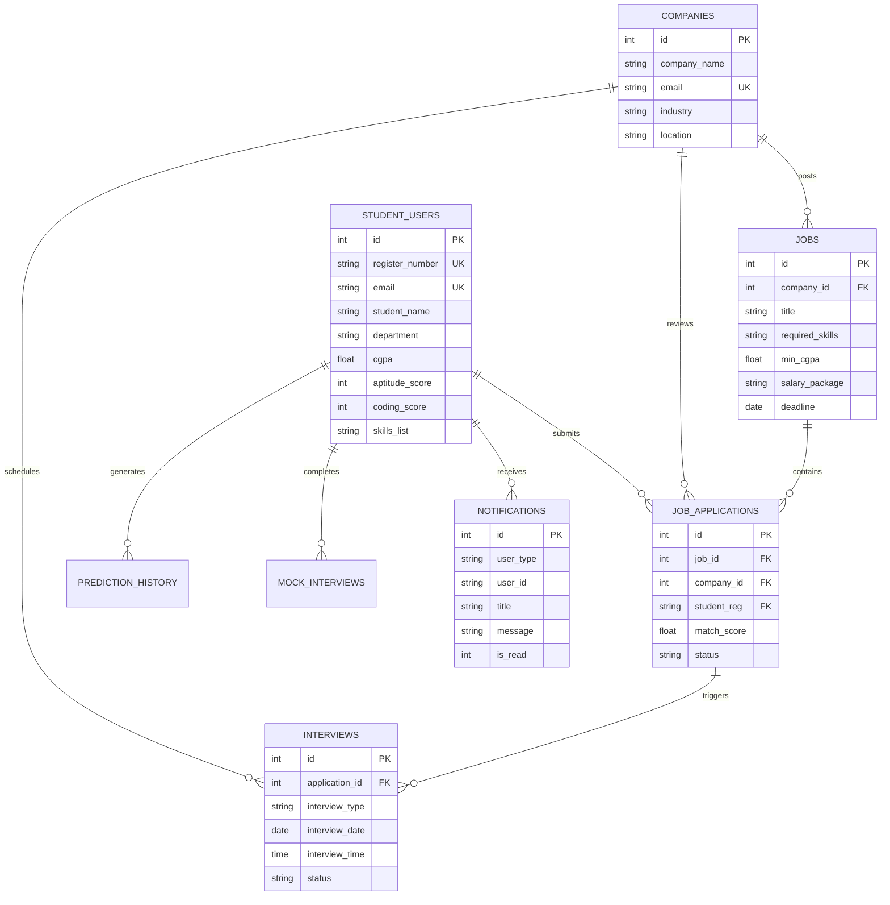
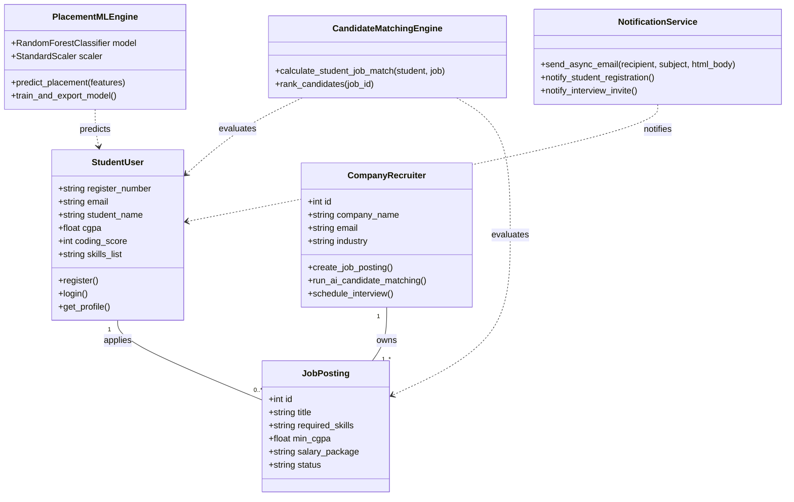
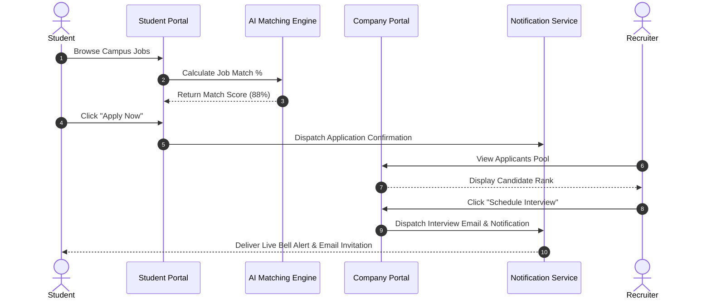
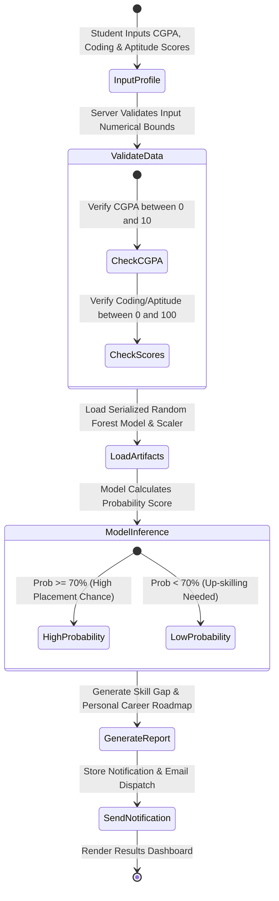
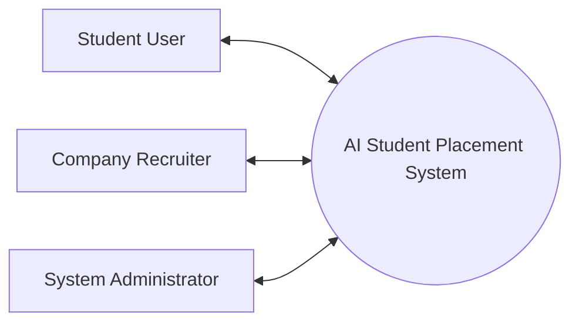
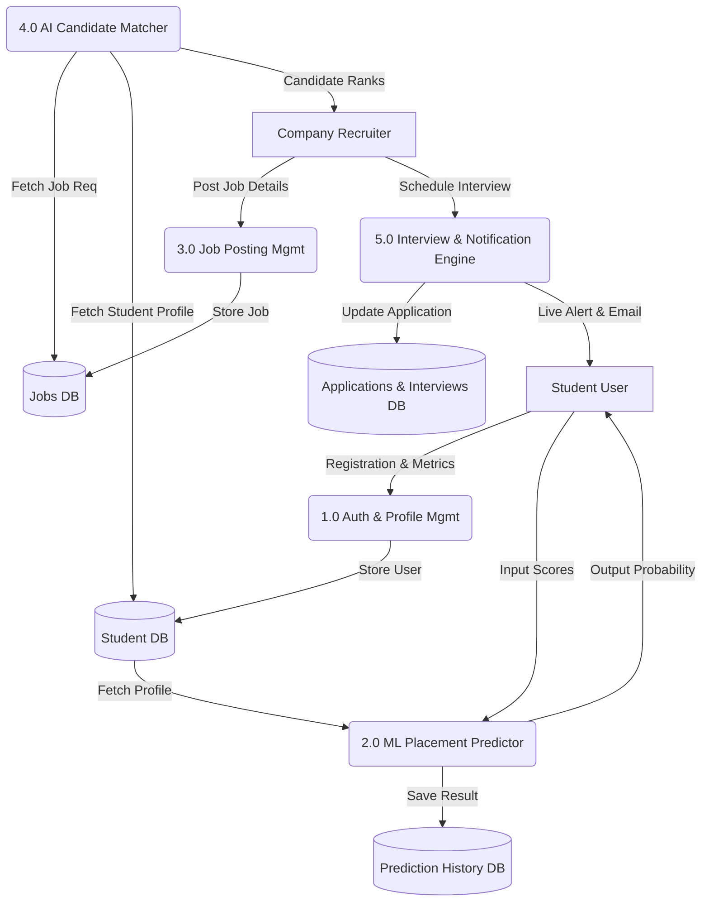

# System Diagrams & Architecture Documentation

This document contains full UML diagrams, Entity-Relationship diagrams, Data Flow diagrams (DFD), and System Architecture specifications rendered using GitHub Markdown Mermaid syntax.

---

## 1. System Architecture Diagram



---

## 2. Use Case Diagram

```mermaid
usecaseDiagram
    actor Student
    actor Recruiter
    actor Admin

    package "AI Student Placement Prediction System" {
        usecase "Register & Log In" as UC1
        usecase "Calculate Placement Probability (ML)" as UC2
        usecase "Analyze Resume (NLP)" as UC3
        usecase "Practice AI Mock Interview" as UC4
        usecase "Explore Campus Jobs & Apply" as UC5
        usecase "Post & Manage Jobs" as UC6
        usecase "Run AI Candidate Matching" as UC7
        usecase "Schedule Candidate Interview" as UC8
        usecase "Manage Students & Train Model" as UC9
        usecase "View In-App & Email Notifications" as UC10
    }

    Student --> UC1
    Student --> UC2
    Student --> UC3
    Student --> UC4
    Student --> UC5
    Student --> UC10

    Recruiter --> UC1
    Recruiter --> UC6
    Recruiter --> UC7
    Recruiter --> UC8
    Recruiter --> UC10

    Admin --> UC1
    Admin --> UC9
    Admin --> UC10
```

---

## 3. Entity-Relationship (ER) Diagram



---

## 4. Class Diagram



---

## 5. Sequence Diagram (Candidate Application & Interview Scheduling)



---

## 6. Activity Diagram (AI Placement Prediction Flow)



---

## 7. Data Flow Diagram (DFD Level 0 & Level 1)

### DFD Level 0 (Context Diagram)


### DFD Level 1 (Detailed Data Flow)

